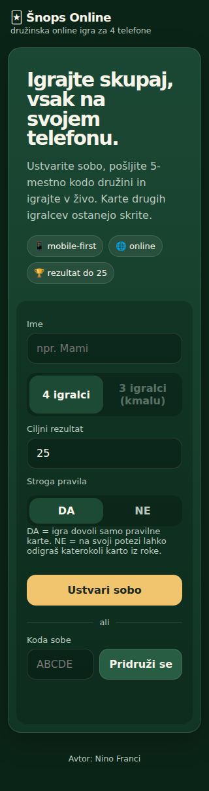
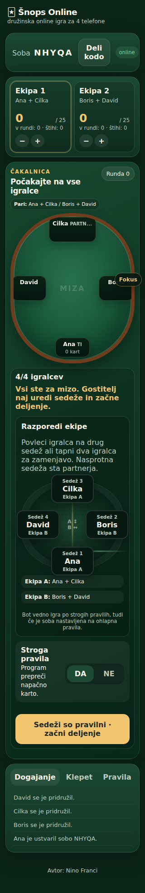
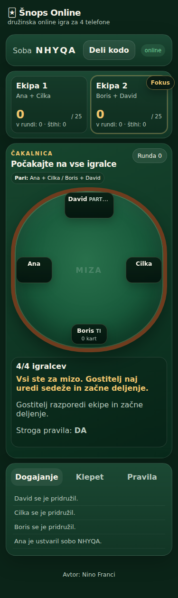
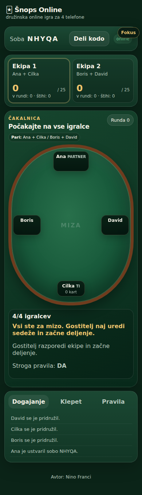
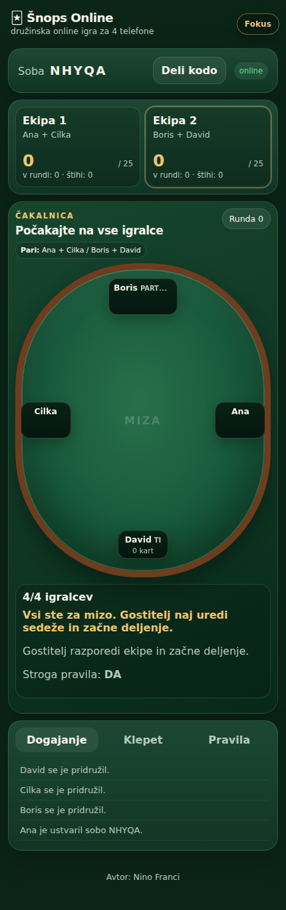
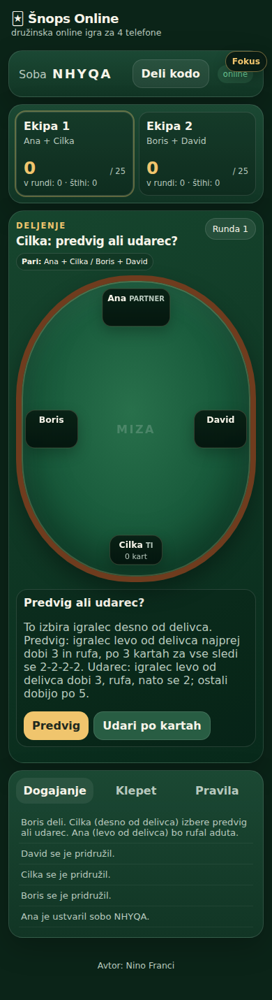
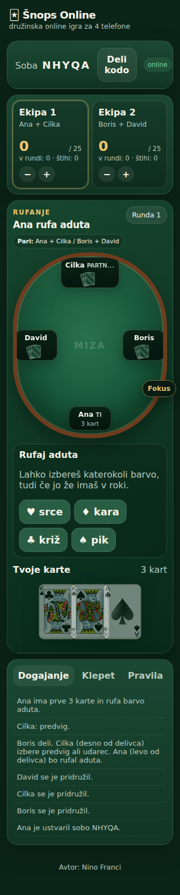
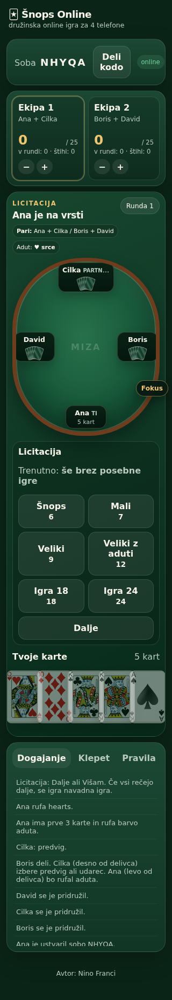

# Šnops Online

Mobilna online igra Šnops za družinsko igranje na ločenih telefonih. Trenutna posodobitev vsebuje nova hišna pravila za **4 igralce / 2 na 2**.

## Kaj je vključeno za 4 igralce

- fiksni pari po sedežih: 1 + 3 proti 2 + 4
- predvig ali udarec po kartah
- rufanje barve aduta po prvih 3 kartah
- 5 kart na igralca
- licitacija: 6, 7, 9, 12, 18, 24
- Dalje in Višam, tudi čez več krogov licitacije
- kontra ×2, kontra nazaj ×3, do konca ×4
- Navadna igra z obveznim barvanjem, preštihanjem in adutom
- 20 / 40, ki se aktivira po osvojenem štihu ekipe
- gumb Štejem za ročno potrditev 66+
- Šnops (6), vključno z gumbom Zaprem
- Mali (7)
- Veliki (9)
- Veliki z aduti (12)
- Igra 18 in Igra 24
- ekipni rezultat do 25; poražena ekipa zapisuje vrednost runde
- Socket.IO sobe, ponovna povezava in klepet
- mobile-first vmesnik in prenovljen videz kart

## Demo prikaz

### Začetni zaslon



### Čakalnica za štiri igralce

| Igralec 1 (320 × 568) | Igralec 2 (375 × 667) |
| --- | --- |
|  |  |

| Igralec 3 (390 × 844) | Igralec 4 (430 × 932) |
| --- | --- |
|  |  |

### Ključna stanja igre

| Predvig ali udarec | Rufanje aduta | Licitacija |
| --- | --- | --- |
|  |  |  |

## Karte

Moč: `J < Q < K < 10 < A`

Točke: `J=2, Q=3, K=4, 10=10, A=11`

## Zagon lokalno

```bash
npm install
npm start
```

Nato odpri `http://localhost:3000`.

## Render

Projekt je pripravljen za Render z datoteko `render.yaml`. Repo poveži kot Blueprint ali Web Service. Po vsakem pushu na GitHub lahko Render samodejno ponovno objavi aplikacijo.

## Pomembno

Pravila za **3 igralce** bomo definirali posebej. Zato je možnost ustvarjanja nove 3-igralne sobe v trenutnem uporabniškem vmesniku označena kot »kmalu« in izklopljena.

### Sedezni vrstni red pri 4 igralcih
- Igralec **desno od delivca** izbere **predvig ali udarec**.
- Igralec **levo od delivca** dobi prve 3 karte in **rufa aduta**.
- Partnerja sedita nasproti: sedeza 1+3 proti 2+4.

## UI v3: sedezi in fokus med igro
- Gostitelj lahko v cakalnici zamenja igralce med 4 sedezi. Sedeza 1+3 sta ekipa 1, 2+4 ekipa 2.
- Pogled mize je na vsakem telefonu relativen igralcu: jaz spodaj, partner nasproti, nasprotnika levo/desno.
- Karte drugih igralcev so prikazane samo s hrbtno stranjo; vsebine rok ostanejo na strezniku skrite.
- Med dejanskim igranjem se vmesnik preklopi v focus mode: skrije rezultat, sobo, log/klepet in glavo ter poudari mizo, adut, igralca na potezi in lastne karte.

## v4 dodatki
- Pri Malem (7) se odigrane karte ne poberejo z mize: vseh pet krogov ostane vizualno razporejenih od sredine proti vsakemu igralcu.
- Gostitelj sedezni red ureja na vizualni mizi. Na racunalniku lahko igralce vlece, na telefonu pa tapne dva igralca za zamenjavo.
- Ko so vsi 4 igralci v sobi, se prikaz takoj preklopi na mizo/focus pogled, se preden se zacne deljenje.
- `public/cards/` je pripravljen za prave PNG slike kart; ce slike ni, ostane CSS nadomestna karta.
- `PUSH_CHANGES.bat` in `GIT-WORKFLOW.md` omogocata normalen git push brez rocnega nalaganja datotek.

## v5 spremembe
- Fokus način je izbira vsakega igralca in se shrani na njegovem telefonu.
- Fokus skrije header, rezultat, dogajanje, klepet in pravila; ostanejo igralna miza, adut, igralec na vrsti, akcije in roka.
- 20/40 se lahko napove samo ob začetku štihа. Igralec izbere Q ali K kot dejansko odigrano karto; druga karta para se na mizi pokaže prosojno in ostane v roki.
- Strežnik še vedno strogo preverja dovoljene karte pri barvanju/adutu.


## Stroga pravila
Gostitelj ob ustvarjanju sobe ali v čakalnici izbere **DA/NE**. Pri DA strežnik dovoli samo legalne karte glede na pravila. Pri NE lahko igralec na svoji potezi odigra katerokoli karto iz svoje roke; vrstni red potez in skrite roke ostanejo strežniško nadzorovani.

## Boti (v7)

Pri igri na 4 lahko gostitelj v čakalnici prazne sedeže zapolni z boti. Bote lahko pred začetkom odstrani ali prestavi enako kot druge igralce. Če se pravi igralec pridruži sobi, ki je polna zaradi botov, v čakalnici avtomatsko zamenja prvega bota.

Bot vedno uporablja strogo preverjanje dovoljenih kart, tudi če je soba nastavljena na ohlapna pravila. Bot sam izbere predvig/udarec, rufa aduta, sodeluje v licitaciji, odigra svoje karte, uporablja 20/40 in šteje oziroma zapre, ko izpolni pogoje. Trenutna strategija je namenoma zadržana in jo je mogoče kasneje nadgraditi z več težavnostnimi stopnjami.
